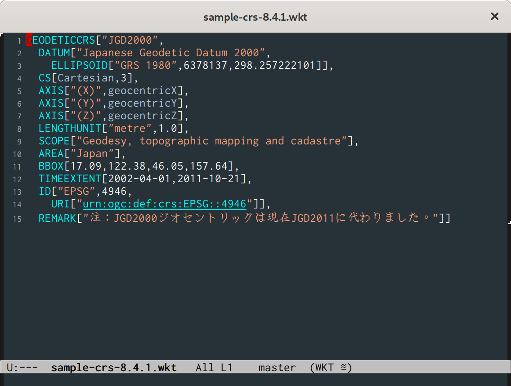

# wkt-mode

Emacs major mode to edit files in Well Known Text format

The mode provides:
- Syntax higlighting
- Line indentation
- Command to beautify buffer content

Files with `.prj` or `.wkt` extensions have their major mode defined
to be `wkt-mode`.

To beautify the buffer content, either enter the key sequence `C-c
C-f` or call `M-x wkt-beautify`: It adds new lines before keywords
preceded by a comma then reindent. This command applies to the active
region or whole buffer.

## Todo

- Browse ID's reference, at least when the authority is EPSG

- Support for geometries

- Display keywords in upper case

- flymake if any linter is available

- Info-lookup support if spec can be converted to info

## References

- [Standard](http://www.opengeospatial.org/standards/sfa)

- [Well-known text representation of coordinate reference systems](http://www.opengeospatial.org/standards/wkt-crs)
